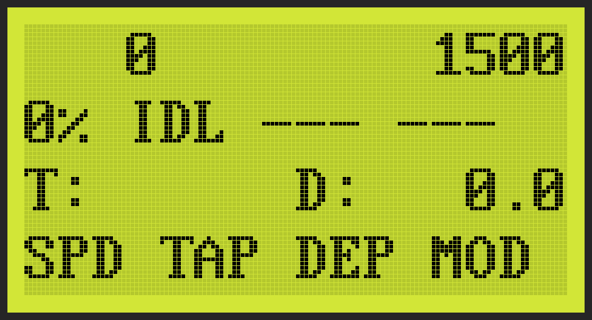
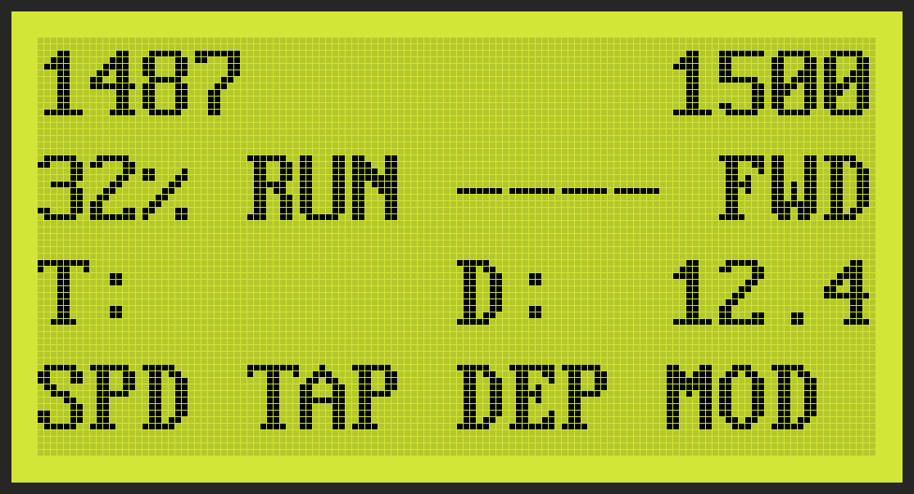
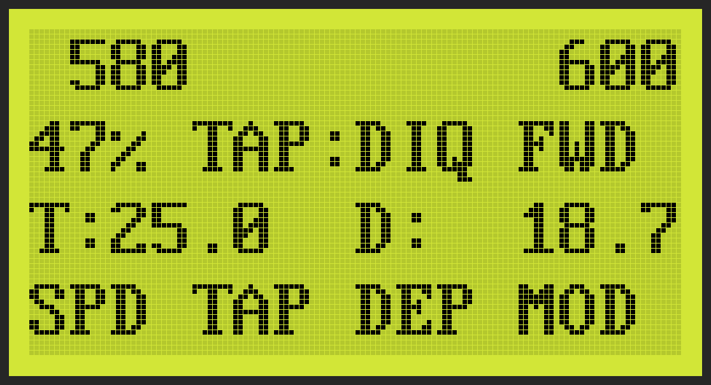
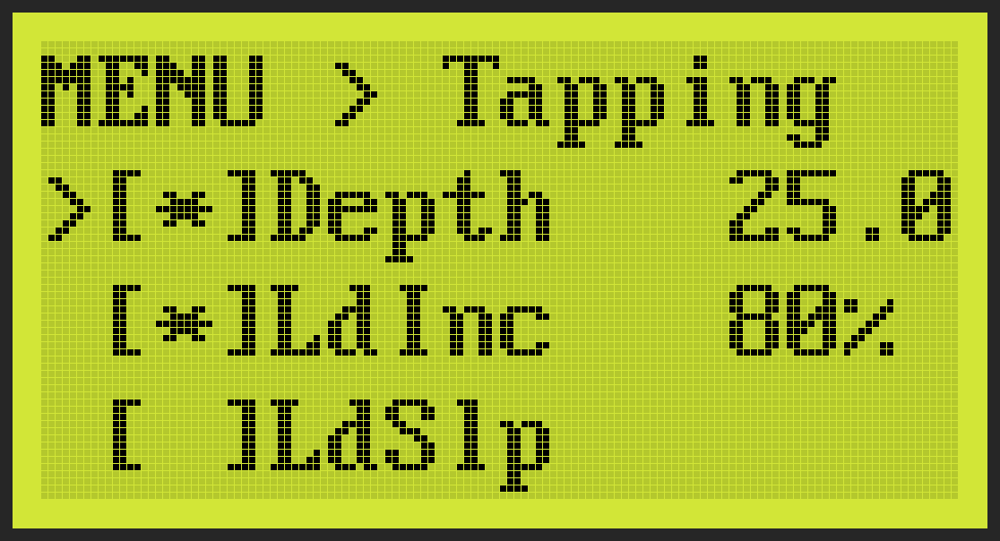

# Nova Voyager Open Firmware

Open-source replacement firmware for the **Teknatool Nova Voyager DVR**
drill press HMI controller (GD32F303RCT6, ST7920 16×4 LCD, FreeRTOS).

<table>
<tr>
<td></td>
<td></td>
</tr>
<tr>
<td align="center"><sub>Idle — target 1500 RPM, no depth target</sub></td>
<td align="center"><sub>Drilling at 1487 RPM, 32% load, 12.4 mm</sub></td>
</tr>
<tr>
<td></td>
<td></td>
</tr>
<tr>
<td align="center"><sub>Tapping with Depth+LoadInc+Quill triggers active</sub></td>
<td align="center"><sub>Menu: per-trigger configuration</sub></td>
</tr>
</table>

> ⚠️ **Community-developed, reverse-engineered firmware.** No warranty
> of any kind. Installing this replaces the OEM firmware. You take on
> all responsibility for the consequences.

---

## Differences from the original Teknatool firmware

| Aspect | Original (R2P06x CG) | This firmware |
|--------|----------------------|----------------|
| License | Closed, proprietary | GPL-3.0 |
| Source | Not public | Public, fully documented |
| Cold boot | ~5 s | ~1.7 s |
| Soft boot | ~0.5 s | ~0.25 s |
| LCD mode | Graphics — animated logo, icons | **Text only** — see note below |
| Tapping | Single mode | 6 **combinable** triggers + manual pedal |
| Foot pedal input | Connector exposed on `X11` but **unused** | Driven as PC3 input — enables hands-free chip-break and reverse override (see [Foot pedal section](#foot-pedal--optional-hardware-addition)) |
| Hardware E-Stop | Software-queued via UART | Direct GPIO cutoff (PD4) before any queue |
| Scheduler | Bare-metal | FreeRTOS, 5 tasks, per-task heartbeat watchdog |
| Firmware updates | Vendor tool only | Standard USB DFU (with companion bootloader) |
| End-user diagnostics | None | Serial console: 98 commands, live state, stack/heap monitor |
| MCB protocol | Undocumented | Documented in `docs/MOTOR_PROTOCOL.md` |
| Safety interlocks | Fixed | Guard / foot-pedal / depth checks individually configurable |

**Why text-only LCD?** The original firmware drives the ST7920 in graphics
mode for the startup animation and icons. We deliberately stayed in
text mode: simpler code, faster boot, no flicker, easier to extend.
Graphics-mode driver code is in the repo (`src/lcd_graphics*.c`,
`src/gfx_*.c`) for anyone who wants to revive icons — see also
`docs/ST7920_*.md` for the reverse-engineering notes.

---

## Quick start

```bash
# Build production firmware (120 MHz, optimized)
pio run -e nova_voyager

# Flash via ST-Link (fast — assumes flash is unlocked from a previous flash)
./flash_firmware.sh quick

# First-time install from OEM firmware (slow — unlocks flash protection)
./flash_firmware.sh custom

# Restore OEM firmware (re-locks flash protection)
./flash_firmware.sh original
```

Companion USB DFU bootloader:
[Packerlschupfer/nova-voyager_bootloader](https://github.com/Packerlschupfer/nova-voyager_bootloader).

---

## Hardware

| | |
|---|---|
| MCU | GD32F303RCT6 (ARM Cortex-M4F, 120 MHz, 256 KB flash, 48 KB RAM) |
| Display | ST7920 16×4 character LCD, 8-bit parallel |
| Motor link | USART3 @ 9600 baud to MCB (Switched Reluctance Motor controller) |
| Inputs | Rotary encoder + 7 buttons (EXTI), foot pedal |
| Sensors | Depth (ADC), guard switch, E-Stop |
| Bootloader | DFU at `0x08000000` (12 KB), application at `0x08003000` (244 KB) |

### Pin map (key signals)

| Signal | Pin | Notes |
|--------|-----|-------|
| LCD data bus | PA0–PA7 | 8-bit parallel |
| LCD RS / RW / E | PB0 / PB1 / PB2 | Control lines |
| Encoder A / B / Btn | PC13 / PC14 / PC15 | 4 counts/detent, button = fine/coarse toggle |
| E-Stop | PC0 | Active high — wired to direct GPIO cutoff path |
| Guard switch | PC2 | Active high (open = high) |
| Foot pedal | PC3 | Active low (X11 connector — see below) |
| Depth ADC | PC1 | ADC1 channel 11 |
| Motor UART | PB10 / PB11 | TX / RX |
| Debug UART | PA9 / PA10 | TX / RX, 9600 baud |

---

## Foot pedal — optional hardware addition

> ℹ️ **Not present on the OEM Nova Voyager.** The HMI board exposes a
> `PC3` input on the **X11** connector that the original firmware does
> not use; this firmware turns it into a foot-pedal input for hands-free
> tapping control.

The foot pedal is purely opt-in — every feature works without one, and
the pedal trigger can be disabled in `Menu → Tapping → Pedal`.

### What you need (reference build)

This is what we used — any equivalent parts work.

| Part | Spec | Where |
|------|------|-------|
| Foot switch | **TFS-1** momentary SPST, NO contacts | At the operator's foot |
| Panel jack | **GX12 2-pin** (aviation-style screw-lock) | Panel-mounted on the chassis, opposite side of the chuck-guard connector |
| Internal cable | **JST PH 2.54mm 3-pin** to the HMI board's `X11` connector | Inside the chassis between the panel jack and the PCB |
| Two short cable runs | ≥ 22 AWG, length to taste | Strain-relief at all junctions — it's a pedal, it gets stepped on |

Only 2 of the 3 JST pins are used (signal + GND). The third pin on
`X11` is left unconnected. The input is `PC3` referenced to `GND`,
**active low** — the firmware reads "pressed" when the line is pulled
to ground. The internal pull-up means an idle pedal (open contacts)
reads as "released" without any external resistor.

### Wiring

```
   foot                  chassis panel               HMI board
                              jack
   ┌─────┐               ┌─────────┐               ┌─────────────┐
   │TFS-1│  ─── 2 ──────┤  GX12   ├── 2 ──────────┤ X11 (JST PH │
   │ NO  │   wire       │  2-pin  │    wire        │ 3-pin):     │
   │ SPST│              │  panel  │                │  PC3 — sig  │
   │     │              │  jack   │                │  GND        │
   └─────┘              └─────────┘                │  N/C        │
                                                   └─────────────┘
       <— external —>      <— bulkhead —>     <— internal —>
```

Either contact orientation works — the firmware debounces the line in
software (~20 ms) and reads the level in `task_ui.c`.

### What the pedal does

Configured per tapping mode in the menu, but typical uses:

- **`Pedal` trigger (manual)** — chip-break: hold to cut, release to
  reverse, or timed `CHIP_BREAK` mode where each press fires a brief
  reverse pulse.
- **`Quill` trigger override** — pedal can override the quill-direction
  auto-reverse (e.g. force a reverse during cutting, or toggle direction
  on each press). See `quill_pedal_mode_t` in `include/config.h`.
- **All triggers** — pedal can be combined with any of the six automatic
  triggers; if both fire, the pedal wins (highest priority).

If the pedal is wired but you don't want to use it for a particular
session, leave the **`Pedal`** trigger unchecked in the menu and it's
electrically ignored.

---

## LCD layout

```
   0        1500     ← actual RPM (left)        target RPM (right)
0% IDL --- ---       ← load%, state, depth tgt, tap mode/direction
T:      D:   0.0     ← target depth (T:)        current depth (D:)
SPD TAP DEP MOD      ← F-key labels (F1..F4)
```

State codes: `IDL` idle · `RUN` drilling · `TAP` tapping · `ERR` error.

---

## Tapping system

Six **combinable** triggers. Enable any subset; the highest-priority
firing trigger wins.

| Code | Trigger | What it watches | Use case |
|:----:|---------|-----------------|----------|
| `D` | Depth | Quill depth sensor | Stop / reverse at target depth |
| `I` | Load Increase | KR (load %) spike | Blind holes / excessive resistance |
| `S` | Load Slip | CV (commanded velocity) overshoot | Through-hole exit detection |
| `C` | Clutch Slip | Load plateau | Torque-limiter / clutch engaged |
| `Q` | Quill | Quill direction change | Auto-reverse on quill lift |
| `K` | Peck | Timed forward/reverse cycles | Chip clearance for taps |
| `P` | Pedal | Foot pedal state | Manual override (chip break / hold) |

Display string `TAP:DISQ` means Depth + LoadInc + Slip + Quill all active.

Priority ordering: **Pedal > Quill > Depth > Load > Peck**.

<details>
<summary>Example combinations</summary>

- **Depth + Quill** — auto-reverse on quill lift, hard stop at target depth
- **LoadInc + LoadSlip** — covers both blind-hole and through-hole scenarios
- **Quill + Pedal** — automatic quill following plus manual override
- **Depth + Load + Quill** — maximum-coverage safety: any condition triggers

</details>

---

## Architecture

5 FreeRTOS tasks coordinated through queues + a state mutex:

| Task | Prio | Stack | Rate | Role |
|------|:---:|:-----:|:---:|------|
| Main | 1 | 256 W | ~100 Hz | Event queue, console, watchdog |
| Depth | 2 | 96 W | 50 Hz | ADC quill sensor |
| UI | 2 | 128 W | 50 Hz | Buttons, encoder, LCD |
| Tapping | 3 | 160 W | 20 Hz | Tapping state machine |
| Motor | 4 | 192 W | 2/20 Hz | UART to MCB (adaptive: idle vs. running) |

Per-task heartbeat watchdog: the main loop only feeds the IWDG if all
tasks have updated their heartbeats recently *and* the event queue isn't
saturated.

Three-layer motor stack:

```
task_motor.c         FreeRTOS coordination
  └─ motor.c         High-level API (start/stop/setSpeed/...)
      └─ motor_protocol.c   Packet build/parse
          └─ motor_uart.c   USART3 hardware abstraction
```

---

## Serial console

Connect at 9600 baud (PA9/PA10). 98 commands available. Most useful:

| Command | What it does |
|---------|--------------|
| `HELP` | List all commands |
| `STATUS` | System state, queues, overflow counters |
| `STACK` | Per-task FreeRTOS stack high-water marks |
| `DEPTH` | Live depth-sensor reading |
| `GUARD` | Guard / pedal / E-Stop GPIO state |
| `GF` | Query MCB flags |
| `CV` | Query MCB current speed |
| `TAP` | Show / configure tapping triggers |
| `RESET` / `COLDBOOT` | Software reset (soft / cold simulation) |
| `DFU` | Reboot into USB DFU bootloader |
| `SAVE` | Persist settings to flash |

---

## Safety

- **Hardware E-Stop** — direct GPIO write to PD4 (motor enable) before
  any queued command. Cannot be delayed by a stuck task or full queue.
- **Guard interlock** — motor refuses to start with guard open;
  auto-stops if guard opens during operation. Configurable.
- **Watchdog** — IWDG ~3 s, only fed when all tasks alive and event
  queue is draining. A saturated queue is treated as a stall.
- **Optimistic state writes** — `motor_running` set immediately on
  start, so the encoder speed-update path is never gated on a stale
  flag.
- **Settings flash-write guard** — `settings_save()` refuses to write
  flash while the motor is running (flash erase blocks the CPU ~20 ms).

---

## Project status

- All major features implemented; firmware is in daily use
- **81 native unit tests** (80 passing, 1 documented skip — needs
  dynamic UART mock)
- **0** compiler warnings on production build
- **~33% flash** / **~23% RAM** used (lots of headroom)

Possible follow-up work (none urgent):
- Animated graphics mode (the driver is already there, just unused)
- Bluetooth/serial telemetry for external logging
- Encoder-based step/direction support for CNC-style operation

---

## License

GNU General Public License v3.0 — see [LICENSE](LICENSE).

This firmware is community reverse-engineered. **No warranty.** You
run it on your hardware at your own risk.

## Credits

Reverse engineering and development based on independent analysis of
the original Teknatool firmware (R2P05x, R2P06e, R2P06k variants),
combined with logic-analyzer captures of the MCB protocol and a great
deal of patient experimentation. Thanks to the lathe / drill-press
community for sharing notes and observations.
