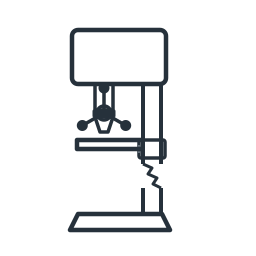
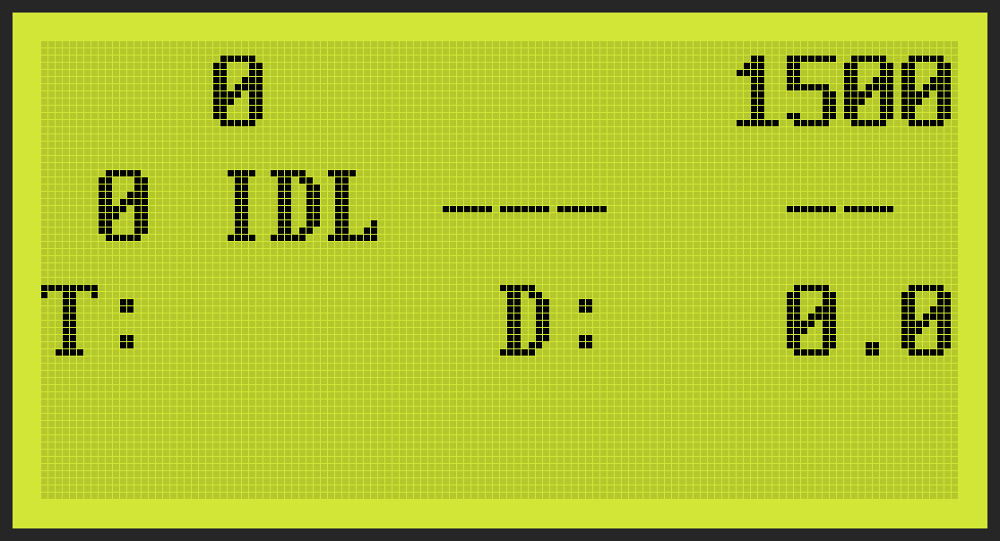
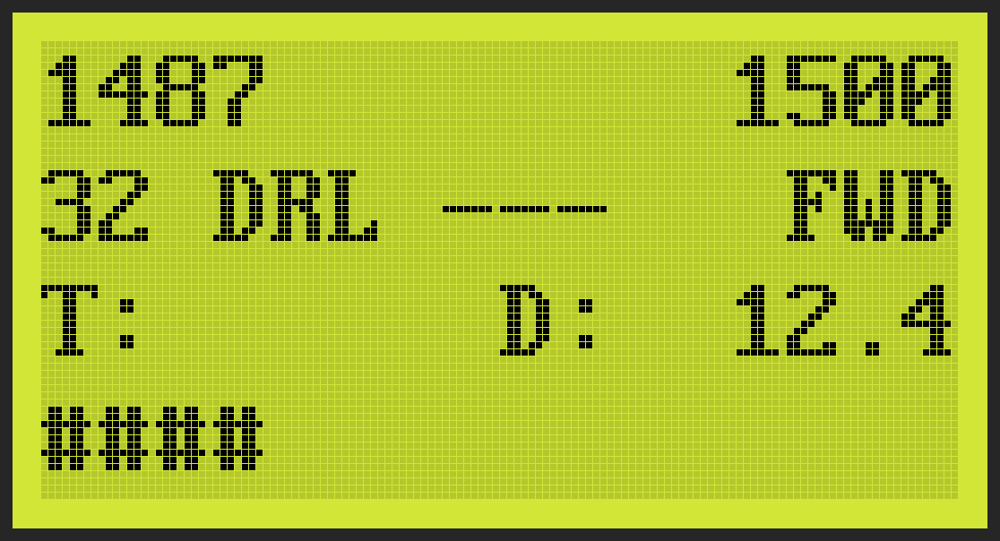
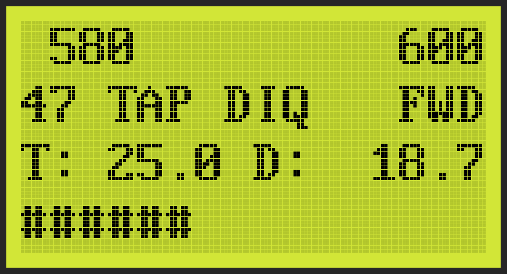
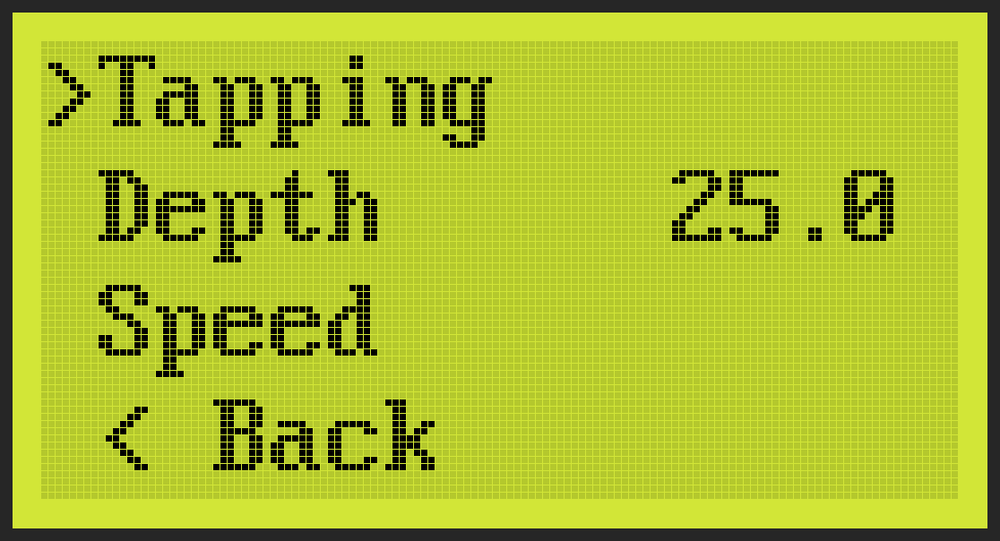
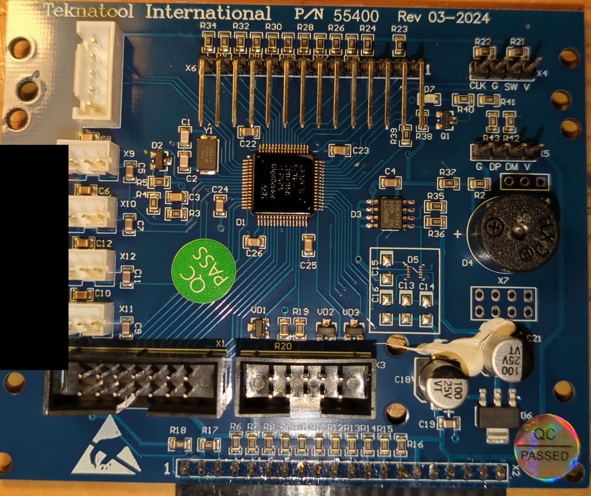

<p align="center">
  <picture>
    <source media="(prefers-color-scheme: dark)" srcset="docs/branding/nv-logo-dark-1024.png">
    
  </picture>
</p>

<h1 align="center">Nova Voyager Open Firmware</h1>

<p align="center">
  Open-source replacement firmware for the <b>Teknatool Nova Voyager DVR</b>
  drill press HMI controller<br>
  <sub>GD32F303RCT6 · ST7920 16×4 LCD · FreeRTOS</sub>
</p>

---

<table>
<tr>
<td></td>
<td></td>
</tr>
<tr>
<td align="center"><sub>Idle — target 1500 RPM, load bar empty</sub></td>
<td align="center"><sub>Drilling at 1487 RPM, 32% load, 12.4 mm depth</sub></td>
</tr>
<tr>
<td></td>
<td></td>
</tr>
<tr>
<td align="center"><sub>Tapping at 580 RPM with Depth+LoadInc+Quill triggers</sub></td>
<td align="center"><sub>Menu navigation (wraps at top/bottom)</sub></td>
</tr>
</table>

<p align="center">
  
  <br>
  <sub>The HMI board this firmware runs on — Teknatool P/N 55400 Rev 03-2024.
  GD32F303RCT6 centre, AT24C02 settings EEPROM to its right, SWD on the
  <code>X4</code> header (<code>CLK G SW V</code>) top-right.
  More in <a href="docs/HARDWARE_SETUP.md">docs/HARDWARE_SETUP.md</a>.</sub>
</p>

> Community-developed firmware based on reverse engineering.
> Installing this replaces the OEM firmware. Back up your OEM image
> first — see [`docs/HARDWARE_SETUP.md`](docs/HARDWARE_SETUP.md).

---

## What this adds

- **Tapping** — 6 combinable triggers (depth, load increase, load slip,
  clutch, quill direction, peck) with GF bit 2 direction-change polling
- **Foot pedal** — uses the unused X11 connector on the HMI board for
  hands-free chip-break and reverse override
- **Load bar** — ST7920 CGRAM bar graph on row 3 (40-step, 16x16 custom chars)
- **F4 display modes** — load bar / temperature + DC bus voltage / speed info / off
- **Material speed calculator** — 12 materials, 9 bit types, auto RPM
- **Configurable motor** — overload threshold (LD), speed ramp (DN),
  max speed, advanced PID submenu, motor profiles (Soft/Normal/Hard)
- **OEM-compatible EEPROM** — speed presets and max RPM survive firmware
  switches; custom settings in 0xB0-0xFF; crash dump persists across power cycles
- **Step drilling** — automatic RPM adjustment by tool diameter
- **Favorite speeds** — F1 cycles presets, long-press saves current RPM
- **Sensor alignment** — ALIGN command tests RPS phases via voltage hold
- **F0 fault decoding** — motor error screen shows decoded MCB fault code
- **Settings export** — DUMP (all settings) + EEDUMP (EEPROM hex dump)
- **Games** — optional Pong, Snake, Penguin in a separate FreeRTOS task
  (`pio run -e nova_voyager_games`); zero game code in default build
- **Serial console** — 61 production + 38 debug commands (9600 baud)
- **USB DFU updates** — with the companion
  [bootloader](https://github.com/Packerlschupfer/nova-voyager_bootloader),
  no ST-Link needed for subsequent flashes
- **Documented MCB protocol** — see [`docs/MOTOR_PROTOCOL.md`](docs/MOTOR_PROTOCOL.md)
  and [`docs/EEPROM_MAP.md`](docs/EEPROM_MAP.md)

---

## Quick start

```bash
# Build (production, no games)
pio run -e nova_voyager

# Build with games (Pong, Snake, Penguin)
pio run -e nova_voyager_games

# Flash via ST-Link (fast — assumes flash already unlocked)
./flash_firmware.sh quick

# First-time install (unlocks flash protection, writes bootloader + app)
./flash_firmware.sh custom

# Restore OEM firmware
./flash_firmware.sh original
```

For bench setup, wiring, and first-flash instructions see
[`docs/HARDWARE_SETUP.md`](docs/HARDWARE_SETUP.md).

---

## Hardware

| | |
|---|---|
| MCU | GD32F303RCT6 (ARM Cortex-M4F, 120 MHz, 256 KB flash, 48 KB RAM) |
| Display | ST7920 16x4 character LCD, 8-bit parallel |
| Motor link | USART3 @ 9600 baud to MCB (Switched Reluctance Motor controller) |
| Inputs | Rotary encoder + 7 buttons (EXTI), foot pedal |
| Sensors | Depth (ADC), guard switch, E-Stop |
| Bootloader | DFU at `0x08000000` (12 KB), application at `0x08003000` (244 KB) |

### Pin map

| Signal | Pin | Notes |
|--------|-----|-------|
| LCD data bus | PA0-PA7 | 8-bit parallel |
| LCD RS / RW / E | PB0 / PB1 / PB2 | Control lines |
| Encoder A / B / Btn | PC13 / PC14 / PC15 | 4 counts/detent, button = fine/coarse toggle |
| E-Stop | PC0 | Active high, direct GPIO cutoff path |
| Guard switch | PC2 | Active high (open = high) |
| Foot pedal | PC3 | Active low (X11 connector) |
| Depth ADC | PC1 | ADC1 channel 11 |
| Motor UART | PB10 / PB11 | TX / RX |
| Debug UART | PA9 / PA10 | TX / RX, 9600 baud |

---

## LCD layout

```
1487        1500     <- actual RPM (left), target RPM (right)
32 DRL ---   FWD     <- load, state, triggers, direction
T:      D:  12.4     <- target depth, current depth
[||||||||         ]  <- load bar (F4 cycles: load / temp / speed / off)
```

State codes: `IDL` idle, `DRL` drilling, `TAP` tapping, `STP` step drill, `MNU` menu.

### F-keys

| Key | Short press | Long press |
|-----|-------------|------------|
| F1 | Cycle favorite speeds | Save current RPM to favorites |
| F2 | Arm / disarm tapping | — |
| F3 | Set depth target to current depth | — |
| F4 | Cycle row 3 (load bar / temperature / speed info / off) | — |

---

## Tapping

Six **combinable** triggers. Enable any subset in the menu; arm with F2.

| Code | Trigger | Watches | Use case |
|:----:|---------|---------|----------|
| `D` | Depth | Quill depth sensor | Stop / reverse at target depth |
| `I` | Load Inc | KR (load %) spike | Blind holes, excessive resistance |
| `S` | Load Slip | CV overshoot | Through-hole exit detection |
| `C` | Clutch | Load plateau | Torque limiter engaged |
| `Q` | Quill | Quill direction change | Auto-reverse on quill lift |
| `K` | Peck | Timed cycles | Chip clearance |
| `P` | Pedal | Foot pedal | Manual chip-break / hold |

Priority: **Pedal > Quill > Depth > Load > Peck**.

---

## Foot pedal (optional)

The HMI board exposes PC3 on the **X11** connector. The OEM firmware
doesn't use it; this firmware reads it as a foot-pedal input.

| Part | Spec |
|------|------|
| Foot switch | TFS-1 momentary SPST, NO contacts |
| Panel jack | GX12 2-pin, panel-mounted |
| Internal cable | JST PH 2.54mm 3-pin to X11 |

```
  foot switch          chassis panel jack          HMI board X11
   ┌─────┐               ┌─────────┐               ┌──────────┐
   │TFS-1│──── 2 wire ───┤  GX12   ├──── 2 wire ───┤ PC3 sig  │
   │ NO  │               │  2-pin  │               │ GND      │
   └─────┘               └─────────┘               │ N/C      │
                                                    └──────────┘
```

Active low, internal pull-up. Disable in `Menu > Tapping > Pedal`
if wired but not wanted for a session.

---

## Architecture

5 FreeRTOS tasks (+ 1 dynamic game task when games are active):

| Task | Prio | Stack | Rate | Role |
|------|:---:|:-----:|:---:|------|
| Main | 1 | 256 W | ~100 Hz | Event queue, console, watchdog |
| Depth | 2 | 96 W | 50 Hz | ADC quill sensor |
| UI | 2 | 256 W | 50 Hz | Buttons, encoder, LCD |
| Tapping | 3 | 160 W | 20 Hz | Trigger state machine |
| Motor | 4 | 192 W | 2/20 Hz | UART to MCB (adaptive) |

Per-task heartbeat watchdog: the main loop feeds the IWDG only when
all tasks have checked in and the event queue is draining. A task that blocks
longer than `HEARTBEAT_TIMEOUT_MS` (2 s) triggers a console alarm; a *reset*
needs the IWDG to expire on top of that, roughly 7 s of contiguous blocking.
Long UI waits use `delay_ms_ui()`, which beats the heartbeat while it waits. HAL tick
kept in sync via `vApplicationTickHook()` → `HAL_IncTick()`.

Motor stack:

```
task_motor.c           FreeRTOS task, command queue, status polling
  +- motor.c           MCB parameter API (profile, PID, power)
  +- motor_protocol.c  Packet build / parse
  +- motor_uart.c      USART3 hardware (polled RXNE — see below)
```

`USE_USART3_DMA` exists but is **not defined**, so RX is a bare `RXNE` poll with
no buffering: a byte survives one character time, ~1.04 ms at 9600 baud. Any
reader that sleeps between polls overruns after the first byte — which is
exactly what `motor_read_param()` did (`delay_ms(2)`), and why every console
parameter read returned -1 until it was rewritten to poll tightly and stop at
ETX, the way `task_motor.c::wait_response()` always had.

---

## Safety

- **E-Stop** — ISR drives PD4 low (motor enable) before any queued
  command. Cannot be delayed by a stuck task, full queue, or UART failure.
- **Guard interlock** — motor refuses to start with guard open;
  auto-stops and activates spindle hold if guard opens while running.
- **Single start gate** — every path that energizes the spindle goes
  through `safety_can_start_motor()` (`include/safety.h`). Nothing in C
  enforces that, so `scripts/check-safety-gate.sh` does: it fails the
  build if a function drives the motor-enable line without consulting the
  gate. Added after review found the console `ALIGN` command bypassing it.
  The gate also refuses while an MCB parameter write is in progress, because
  that suspends the poll loop the jam detectors live in.
- **MCB writes are exclusive** — syncing parameters to the motor controller
  pauses the status poll, which also suspends all four jam detectors. Those
  commands (`MSYNC`, `MSAVE`, `MREAD`, menu Save/Reset) therefore claim an
  envelope that refuses while the machine is drilling or tapping, and refuse
  each other rather than tearing down an active write.
- **Edge-latched interlocks** — the guard and E-Stop handlers act on the edge
  latched by the ISR, not on the pin level at the moment the event is
  processed. A guard bumped open and shut before the event is dequeued still
  stops and brakes the spindle.
- **Queue purge** — E-Stop, guard open, and motor fault purge the motor
  command queue to prevent stale FORWARD/REVERSE from re-enabling the motor.
- **Watchdog** — IWDG ~3 s, fed only when all 5 tasks are alive and the
  event queue is draining. Queue saturation = stall = reset.
- **EEPROM settings** — when EEPROM is present, no flash writes needed
  (no 20ms CPU stall, safe to save while motor running).
- **Last-used speed remembered** — the spindle speed is written to EEPROM once
  the encoder has been still for 5 s and the value differs from what is stored,
  so pressing OFF (wired to NRST) no longer loses it. Two bytes per adjustment,
  not one write per detent; matches the original firmware's behaviour.
- **COMM FAULT** — 15 consecutive UART failures trigger hardware motor
  disable + fault state with F0 code decoding.
- **USART overrun handling** — on the MCB link, ORE and RXNE are reported
  together and the pending byte is returned rather than discarded. The old
  recovery read `DR` purely to clear the flag, throwing away a valid unread
  byte, and then reported availability from a stale status snapshot.
- **Depth target** — auto-stop and beep when quill reaches target depth
  or step drill reaches target diameter.

---

## Serial console

9600 baud on PA9/PA10. 61 production commands — start with `HELP`.

| Command | What it does |
|---------|--------------|
| `STATUS` | System state, queues, overflow counters |
| `STACK` | Per-task stack high-water marks |
| `DEPTH` | Live depth sensor |
| `GUARD` | Guard / pedal / E-Stop GPIO state |
| `KR` | Query MCB load percentage |
| `CV` | Query MCB current speed |
| `TAP` | Show / configure tapping triggers |
| `SPEED <rpm>` | Set target RPM |
| `DUMP` | Export all settings as key=value |
| `EEDUMP` | Hex dump HMI EEPROM (256 bytes) |
| `MREAD` | Read the nine MCB parameters back |
| `MSYNC` / `MSAVE` | Push settings to the MCB / persist them there |

`MSYNC`, `MSAVE` and `MREAD` refuse while the machine is drilling or tapping,
and refuse each other: each pauses the MCB status poll, and the jam, load-spike,
step and stall detectors all run inside that poll. A read-only diagnostic is not
worth blinding them mid-cut. Stop the spindle and repeat.

`SAVE` reports what actually happened — a save whose flash mirror had to be
deferred says so rather than claiming success.
| `ALIGN [A/B/C/OFF]` | Sensor alignment test |
| `GAME P/S/N` | Pong / Snake / Penguin (games build only) |
| `DFU` | Reboot into USB DFU bootloader |
| `SAVE` | Persist settings to EEPROM |

---

## Build gates

CI and the release workflow run three checks that encode invariants the
compiler and the test suite cannot:

| Script | Enforces |
|--------|----------|
| `scripts/check-pins.sh` | The toolchain/framework pins in `platformio.ini` are actually applied per-env — a pin declared only in `[common]` is silently ignored, which is how the first release binary differed from the tested one. |
| `scripts/check-safety-gate.sh` | Every function that drives the motor-enable line consults `safety_can_start_motor()`, or is on a two-entry allowlist with a reason. No test can see a gate that was never called. |
| `scripts/check-settings-mirror.sh` | `test/test_settings`'s local copy of the settings types matches the real headers. `pio test -e native` compiles no `src/`, so that mirror IS the coverage — when it drifts the suite passes while testing a layout the firmware does not ship. |

Each is negative-tested: breaking the invariant makes the script fail and name
the offending symbol.

## Project status

- All features implemented; firmware in daily use
- **445 unit tests** across 18 suites (all passing)

  Five of those suites exercise the *shipping* code rather than a copy, by
  keeping the logic in a header the tests can include directly — `safety.h`,
  `menu_format.h`, `settings_pack.h`, `events_policy.h`, `speed_autosave.h`.
  That matters because `pio test -e native` compiles no `src/`: a suite that
  re-implements the logic it is checking proves only the copy right, which is
  how a guard/E-Stop edge bug and 39 unpersisted settings survived a full
  green suite.
- 0 compiler warnings
- ~31% flash / ~28% RAM (production); ~34% / ~41% RAM with games

---

## License

GPL-3.0 — see [LICENSE](LICENSE).

Community reverse-engineered. No warranty. Use at your own risk.

## Credits

Reverse engineering based on independent analysis of the Teknatool
firmware (R2P05x, R2P06e, R2P06k), logic-analyzer captures of the MCB
protocol, and patient experimentation.
