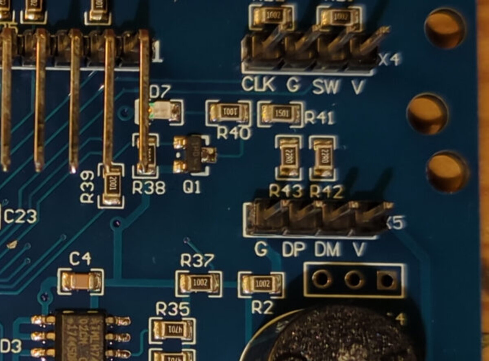
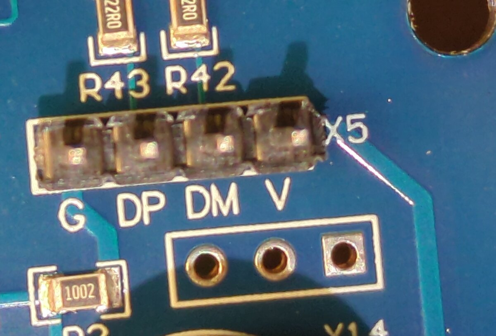
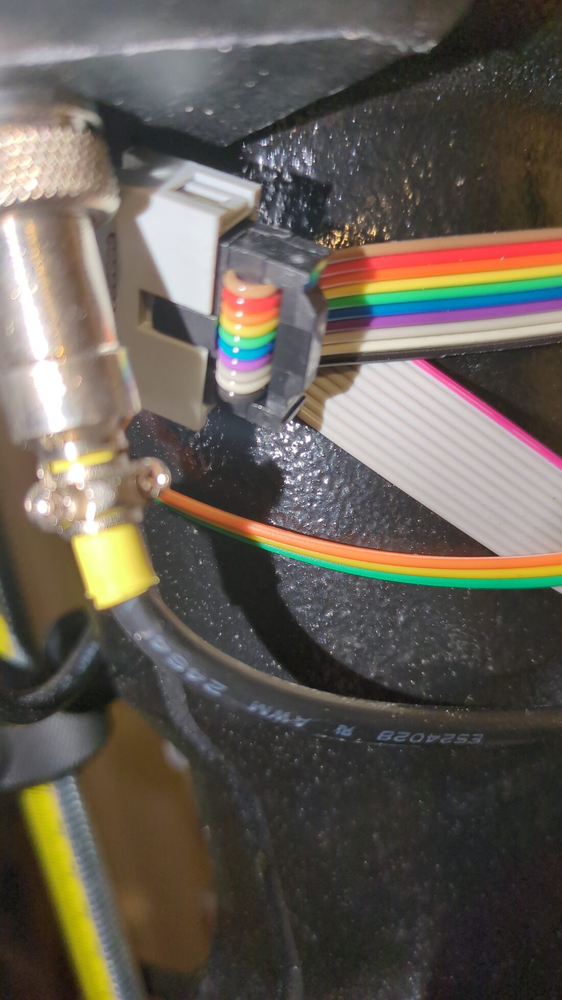
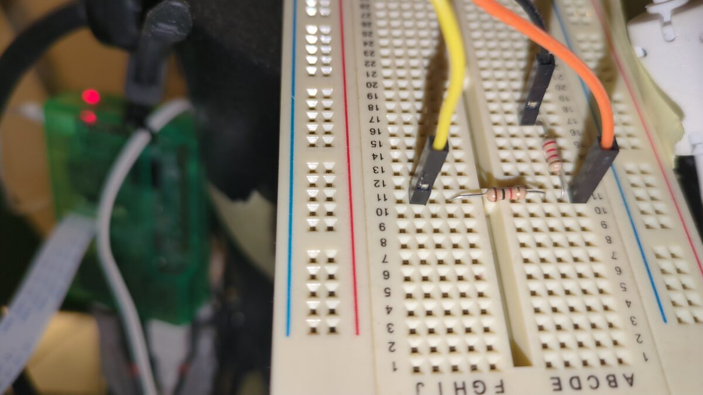
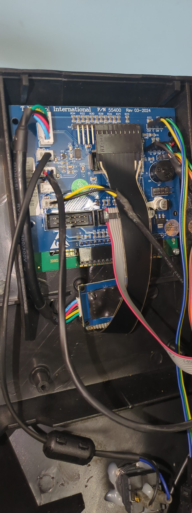
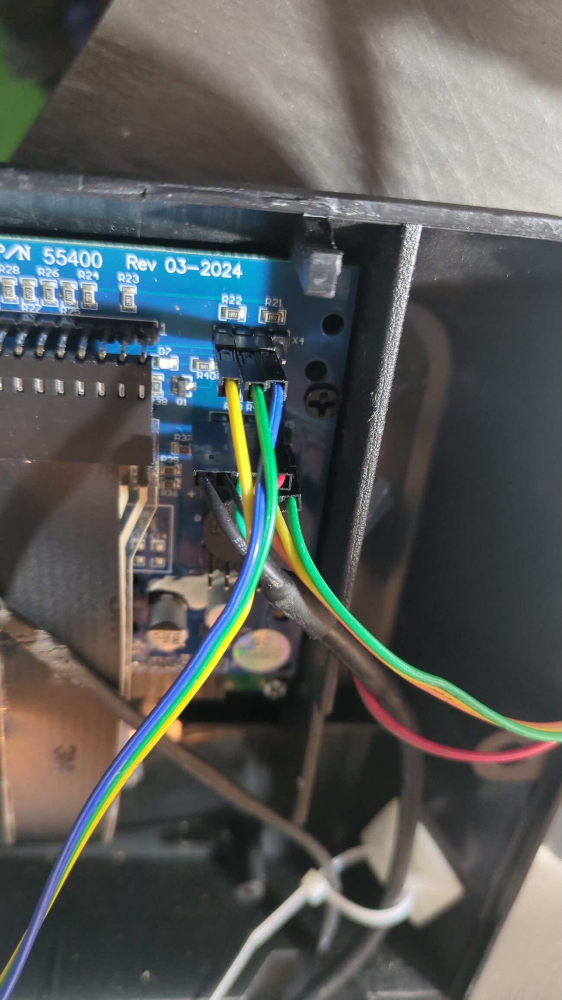
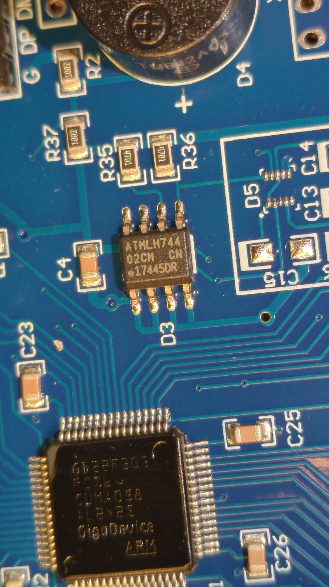
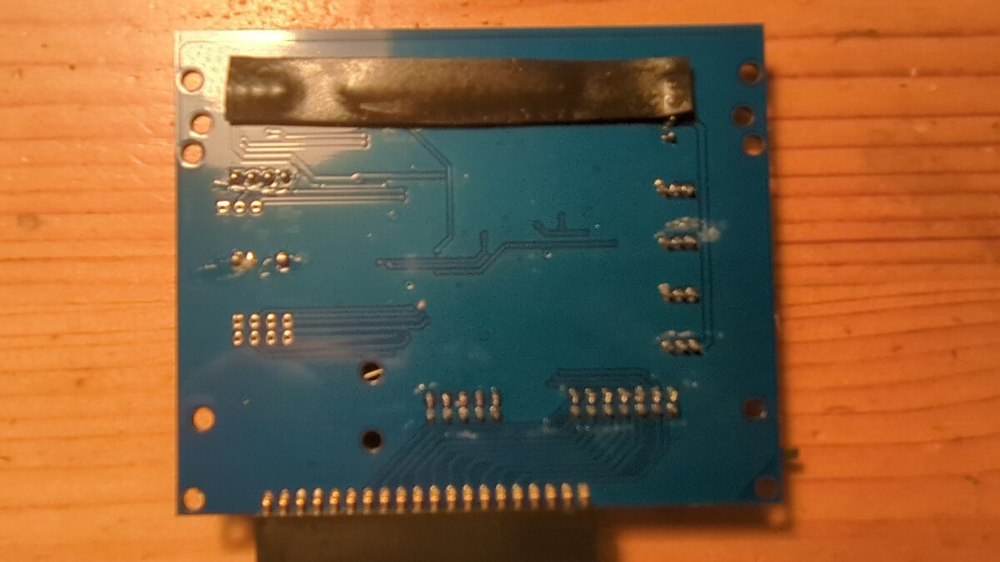

# Developer hardware setup

What you need on your bench to build, flash, and debug this firmware on a
real Nova Voyager HMI board.

> ⚠️ **Back up your OEM firmware before you flash anything.** Read
> [§ First flash](#first-flash--backup-unlock-write) first. If you skip
> the backup, recovery from a generic OEM image is still possible (see
> [§ If you didn't back up](#if-you-didnt-back-up)) — just slower and
> dependent on third parties.

This doc covers the *programmer / debugger / bench* side. The functional
pinout (LCD, encoder, foot pedal, etc.) lives in the main
[README](../README.md#pin-map-key-signals).

---

## What you need

### Required

| Item | Notes |
|------|-------|
| Nova Voyager HMI board | Either in-machine, or on the bench powered from a 24 V supply on the MCB connector. The HMI does not need the MCB or spindle attached to boot. |
| ST-Link V2 (or clone) | The cheap blue-shell USB clones work fine for SWD. ST-Link V3 also works. |
| 4 jumper wires | SWDIO, SWCLK, GND, 3V3 — Dupont female-to-female is fine. |
| USB-UART adapter | 3.3 V logic (FTDI / CP2102 / CH340). Used for the serial console on PA9/PA10 — see [§ Serial console](#serial-console). |
| Host PC with PlatformIO | `pio` CLI installed; works on Linux, macOS, WSL. |

### Optional

| Item | Why |
|------|-----|
| Raspberry Pi (any model with USB) | Acts as a remote flash host — useful if the drill press lives far from your dev machine. The bundled `flash_firmware.sh` is wired for this topology (`PI_HOST` variable at the top of the script). Skip if you flash from your dev machine directly. |
| Foot switch (TFS-1 + GX12) | Only if you want to use the foot-pedal trigger. See README. |
| Logic analyzer (Saleae clone, "24 MHz 8-ch" USB type, sigrok / PulseView) | For sniffing the MCB UART link if you're hacking on the motor protocol. See [§ Logic analyzer](#logic-analyzer--sniffing-the-mcb-protocol). |

---

## SWD wiring to the HMI board

The HMI PCB exposes SWD on the **X4 header**, top-right of the board as
oriented below, silkscreened `CLK G SW V`:


*Teknatool P/N 55400 Rev 03-2024. Board serial redacted.*

| X4 pad | Signal |
|--------|--------|
| `CLK`  | SWCLK  |
| `G`    | GND    |
| `SW`   | SWDIO  |
| `V`    | 3V3 — see the warning below, do not feed this from the ST-Link |



*The three headers together: `X4` (`CLK G SW V`, SWD) at top, `X5`
(`G DP DM V`, USB) below it, and `X14` (3-pin serial) bottom right.*

Neighbouring headers, so they are not confused with X4:

| Header | Silkscreen | Pads | What it is |
|--------|-----------|------|------------|
| `X4` | `CLK G SW V` | 4 | **SWD** — the one you want for flashing |
| `X5` | `G DP DM V`  | 4 | **USB** (D+/D-) |
| `X14` | `X14`, printed below the pads | 3 | **Serial console** — see below |
| `X7` | unlabelled pad array | 8 | Not needed for anything in this repo. It was populated with pin headers during bring-up and turned out to serve no purpose — don't bother. |

The required signals are the standard 4-wire SWD set:

| Signal | ST-Link V2 pin | HMI MCU pin |
|--------|----------------|-------------|
| SWDIO  | Pin 7          | PA13 |
| SWCLK  | Pin 9          | PA14 |
| GND    | Pin 4 / 6 / 8 / 12 / 14 / 16 / 18 / 20 | GND |

**Power the HMI separately — do not connect 3V3 from the ST-Link.**
The HMI draws more than the ST-Link's VAPP rail can comfortably supply.
On the bench, power the HMI from USB (the board's own USB connector is
sufficient on its own); in-machine, the MCB feeds it normally.

Keep wires short (< 15 cm). If you see `Error: init mode failed (unable
to connect to the target)`, double-check GND first, then that the board
is powered.

> **NRST is not required**, and measurement on 2026-08-29 says don't bother
> wiring it. The flash scripts use software reset (`reset halt` in OpenOCD).
>
> The front-panel **OFF button is NRST** (`docs/MOTOR_PROTOCOL.md`), confirmed
> by pressing it and seeing `*** PIN RESET (NRST) ***`. But a hardware pin reset
> does **not** clear the debug domain: after an OFF press the firmware still
> read `DBGMCU_CR at boot: 0x00000307`, i.e. the debugger-frozen watchdog
> survived. Those registers are POR-reset only.
>
> **If the board is wedged, pull the power.** Not OFF, not an ST-Link reset —
> only a power cycle clears a frozen IWDG, and only when the firmware isn't
> running to clear it itself.
>
> Wiring ST-Link pin 15 would only make `--connect-under-reset` functional
> (`flash_firmware.sh` passes it today and cannot honour it). Narrow benefit,
> soldering on a working machine — declined.

---

### Serial console header — `X14`



*`X14`, directly below `X5`. Two round pads then a square one — the square pad
is GND.*

The console is **not** on `X4` or `X5`. It is `X14`, the only 3-pad header on
the board, directly below the 4-pad `X5` and above the buzzer `D4`.

The `X14` designator is printed just below the pads, in small text between the
header and the buzzer `D4`. It is easy to overlook rather than hidden. If in
doubt go by position: it is the only 3-pad header on the PCB, sitting between
the 4-pad `X5` above it and the buzzer below.

**Orientation: the square pad is GND.** It is the pad furthest from `X5`'s
`G` end, i.e. rightmost when the board is oriented as in the photo above.

| `X14` pad | Pad shape | Board signal | Connect to USB-serial adapter |
|-----------|-----------|--------------|-------------------------------|
| left      | round     | **TX** (board transmits) | adapter **RX** |
| middle    | round     | **RX** (board receives)  | adapter **TX** |
| right     | **square**| **GND**      | adapter **GND** |

> **TX and RX cross over.** The board's TX goes to the adapter's RX and vice
> versa. Wiring them straight through is the classic way to get a silent
> console with everything apparently connected.

On the reference machine the leads are, left to right,
**orange – yellow – green**, using an adapter whose colours are
green = GND, orange = RX, yellow = TX. That colour order is consistent with the
square GND pad on the right.

Console settings are **9600 8N1**, no flow control.

## Flash topology — pick one

### A. USB-local (simplest)

ST-Link plugged into your dev machine; OpenOCD / `st-flash` run locally.
Edit `flash_firmware.sh` and set `PI_HOST=""` *or* run the OpenOCD
commands by hand — the script's `run_openocd` helper in
`scripts/gd32_unlock_flash.sh` already has a `local` mode:

```bash
./scripts/gd32_unlock_flash.sh local
```

You need `openocd` and `stlink-tools` (`st-flash`) installed locally.

### B. Pi-tethered (matches the bundled scripts)

ST-Link plugged into a Raspberry Pi on the same network; the dev
machine SSHes to the Pi and drives flashing remotely. This is the
topology `flash_firmware.sh` assumes — useful when the drill press is
not next to your laptop.

```
dev machine ── SSH ──→ Pi ── USB ──→ ST-Link ── SWD ──→ HMI board
                       │
                       └── USB ──→ USB-UART ── PA9/PA10 ── serial console
```

Setup on the Pi:

```bash
sudo apt install openocd stlink-tools
# Allow your user to use the ST-Link without sudo (optional):
sudo cp /usr/share/stlink/49-stlinkv2.rules /etc/udev/rules.d/
sudo udevadm control --reload-rules
```

Edit `PI_HOST` at the top of `flash_firmware.sh` to match your Pi's
hostname/IP, and make sure passwordless SSH (or `ssh-agent`) works so
the script doesn't prompt mid-flash.

---

## First flash — backup, unlock, write

The GD32F303 ships with persistent flash write protection that survives
a mass-erase. The bundled scripts handle this for you, but the order
matters:

### 1. Back up the OEM firmware first

**Do this before anything else.** Once you erase, the factory firmware
is gone unless you have a Teknatool service tool.

```bash
# Adjust the path; runs on the same host as the ST-Link
st-flash --flash=256k read oem_full_backup.bin     0x08000000 0x40000

# Do it a second time and diff — a clean SWD read should be bit-identical
st-flash --flash=256k read oem_full_backup_2.bin   0x08000000 0x40000
cmp oem_full_backup.bin oem_full_backup_2.bin && echo "OK: backups match" \
    || echo "MISMATCH — do not trust either dump, re-read"
```

If the two dumps differ, the SWD link is glitching — check wiring,
shorten leads, drop the adapter speed (`-c 'adapter speed 1000'` in
OpenOCD), and re-read until you get two identical dumps. Only then
you can trust the backup.

Keep the verified `.bin` somewhere safe (and ideally in a separate
backup). `flash_firmware.sh original` restores from canned OEM images
shipped with the project, but your hand-rolled backup is the ultimate
safety net.

### 2. Unlock + flash

```bash
# First-time flash (slow — unlocks protection, then writes bootloader + app)
./flash_firmware.sh custom

# Subsequent flashes (fast — assumes flash already unlocked)
./flash_firmware.sh quick
```

What `custom` does internally:

1. `stm32f1x unlock 0` via OpenOCD — clears option-byte write protection
2. `flash erase_sector 0 0 last` — wipes flash
3. `program bootloader.bin 0x08000000 verify`
4. `program firmware.bin   0x08003000 verify`
5. `reset run`

If you ever see `Flash memory is write protected`, run
`./flash_firmware.sh unlock` to redo step 1 only.

### 3. Restoring OEM

```bash
./flash_firmware.sh original          # latest (r2p06k)
./flash_firmware.sh original r2p05x   # specific version
```

### If you didn't back up

A clean OEM image is still recoverable — slower, but recoverable:

1. **Released versions on the Wayback Machine.** Older Teknatool
   firmware releases were posted publicly and have been captured on
   `web.archive.org`. They are **not the latest** — typically a few
   revisions behind production — but they boot and run.
2. **Teknatool support.** Email support and ask for the latest Voyager
   HMI firmware. They will send it, but **be patient** — in the
   author's experience it took a while before the request was picked
   up. Be specific: serial number of your machine and the firmware
   variant (CG = Chuck Guard).

In both cases the `.bin` you receive flashes at `0x08000000` with the
OEM bootloader (12 KB) at the start and the application at `0x08003000`
— same layout `flash_firmware.sh original` uses.

---

## Serial console

The MCU's UART1 (PA9 = TX, PA10 = RX) runs at **9600 baud, 8N1, 3.3 V**.
Connect a USB-UART adapter:

| HMI pin | Adapter |
|---------|---------|
| PA9 (TX out) | RX |
| PA10 (RX in) | TX |
| GND | GND |

The bundled helpers expect the adapter to appear as `/dev/ttyNova`.
Create a udev symlink, or change `monitor_port` in `platformio.ini`:

```
# /etc/udev/rules.d/99-nova.rules — adjust idVendor/idProduct for your adapter
SUBSYSTEM=="tty", ATTRS{idVendor}=="1a86", ATTRS{idProduct}=="7523", SYMLINK+="ttyNova"
```

Then `pio device monitor`, `screen /dev/ttyNova 9600`, or
`./scripts/serial.sh STATS` for one-shot commands.

98 commands available — start with `HELP`, `STATUS`, `STACK`.

---

## Logic analyzer — sniffing the MCB protocol

Most of the motor-protocol reverse engineering in
[`docs/MOTOR_PROTOCOL.md`](MOTOR_PROTOCOL.md) was done by sniffing the
UART link between the HMI and the MCB with a cheap Saleae clone
(the "24 MHz 8-channel" USB type, sigrok / PulseView compatible).

### Where to probe

Probe at the **X3 connector** rather than directly on the MCU pins.
X3 brings PB10/PB11 out through an existing on-board network of two
resistors and a small transistor (acts as a buffer/level shifter), so
the signal there is well-conditioned and the MCU pins themselves stay
mechanically protected.

X3 is a keyed IDC header — orient by the notch, pin 1 at the notched end,
and a 1:1 IDC cable preserves the numbering.

| Signal | X3 pin | MCU pin behind it | What you see |
|--------|--------|-------------------|--------------|
| GND | 1 | — | Reference. Used for the divider's low side. |
| MCB UART TX (HMI → MCB) | **4** | PB10 | Commands the HMI sends to the motor controller |
| GND | 5 | — | Reference. Used as the analyzer ground. |
| MCB UART RX (MCB → HMI) | **6** | PB11 | Status / sensor replies from the MCB |

Pins 1 and 5 are both confirmed grounds — they are what the reference rig
actually uses. The signals land on even pins with a ground either side, which
is the usual alternating layout for ribbon cable, so **the odd pins are very
probably all GND**. That generalisation has not been measured beyond pins 1 and
5, so meter an odd pin before trusting it as a ground.

#### Identifying pins by ribbon colour

The reference rig's **50 cm analyzer extension** is rainbow ribbon, whose
conductor colours follow the resistor code. Because every link in the chain is
1:1 IDC, conductor *n* of that ribbon is `X3` pin *n* — so on this rig the
colour identifies the pin with no counting:

| Pin | 1 | 2 | 3 | 4 | 5 | 6 | 7 | 8 | 9 | 10 |
|-----|---|---|---|---|---|---|---|---|---|----|
| Colour | brown | red | orange | **yellow** | **green** | **blue** | violet | grey | white | black |

The ones that matter: **yellow = pin 4 = TX**, **green = pin 5 = GND**,
**blue = pin 6 = RX**, brown = pin 1 = GND. Those four were read off the
reference machine; the other six are the standard sequence, not measured here.

Two caveats before relying on this:

- The colour code belongs to **whatever ribbon you use**, not to `X3` itself.
  It only tells you the pin because the whole chain is 1:1. Break that anywhere
  — a reversed connector, a crossover cable — and the colours stop meaning
  anything.
- Grey ribbon has no colour code, only a red stripe marking conductor 1. Count
  from the stripe.

#### Tapping X3 without modifying anything

Don't solder to the board or pierce the harness. Build a short inline
pass-through instead, so the MCB link runs *through* your cable and the spare
ribbon tail gives you probe access:

`X3` on the HMI PCB is a **female** 10-pin socket, so the cable end that goes
into it is male. A stock 10-pin IDC extension cable (male one end, female the
other) is exactly the right part.

```
   HMI X3            9 cm              16 cm
  (female socket)      |                 |
        |              v                 v
     [male]=========[female]=========[female]
                        ^                 |
                   MCB harness            +--> 50 cm rainbow extension
                   plugs in here               |
                                               +--> breadboard + divider
                                                    |
                                                    +--> Dupont female
                                                         --> logic analyzer
```

Method:

1. Take a **10-pin IDC extension cable** (male one end, female the other).
   Plug the **male** end into `X3` on the HMI.
2. IDC-press an extra **female** connector onto the ribbon about 9 cm along.
   IDC contacts pierce the insulation without cutting the conductors, so every
   wire stays continuous for the whole length of the cable.
3. Plug the **MCB harness** into that added connector. The motor link now runs
   exactly as before, just routed through 9 cm of your ribbon.
4. The cable's original **female end**, ~16 cm further on, still carries every
   signal. That is the analyzer take-off — on the reference rig it feeds a
   50 cm rainbow ribbon to the breadboard holding the divider, and from there
   Dupont flying leads reach the analyzer's channel pins.

It is fully reversible: unplug both ends and the machine is back to stock, with
nothing modified and no marks on the harness.

> **Pinout confirmed 2026-08-29** on the reference machine: pin 4 = TX,
> pin 6 = RX, pins 1 and 5 = GND, read off a 1:1 IDC cable keyed by the
> notch. TX on pin 4 corroborates the direction measured by capture, and
> pin 6 = RX matches what this table already recorded.

**Verified capture, 2026-08-29.** Both directions decode cleanly at 9600 8N1
with the fx2lafw driver, sampling at 1 MHz. Captured live while the firmware's
motor task polled the MCB:

```
HMI -> MCB   04 30 30 31 31 31 47 46 05    EOT 0 0 1 1 1 G F ENQ   GF query
             04 30 30 31 31 31 4B 52 05    ...          K R ...    KR query
MCB -> HMI   02 31 47 46 33 32 03 32       STX 1 G F "32" ETX cks  GF = 32, motor stopped
             02 31 4B 52 30 03 1B          STX 1 K R "0"  ETX cks  KR = 0 %, no load
```

Capture and decode:

```bash
sigrok-cli -d fx2lafw --config samplerate=1000000 \
           --channels D0,D1 --time 1500 -o mcb.sr
sigrok-cli -i mcb.sr -P uart:baudrate=9600:rx=D0 -A uart=rx-data   # HMI -> MCB
sigrok-cli -i mcb.sr -P uart:baudrate=9600:rx=D1 -A uart=rx-data   # MCB -> HMI
```

The two directions are trivially distinguishable without knowing the pinout:
the HMI's transmissions start with `0x04` (EOT) and end `0x05` (ENQ), the MCB's
replies start `0x02` (STX) and end `0x03` (ETX) plus a checksum byte. If your
capture shows `04 ...` frames, that channel is TX.

9600 baud, 8N1. PulseView's UART decoder set to 9600 / LSB-first / no
parity decodes the bytes directly. The framing and packet structure
are documented in [`docs/MOTOR_PROTOCOL.md`](MOTOR_PROTOCOL.md).

### Resistors — 5 V → 3.3 V divider (required for clean capture)

The X3 connector exposes signals at roughly 5 V swing. The Saleae
clones' input threshold is set for 3.3 V logic, so a raw 5 V line
either reads erratically or doesn't decode reliably. **Put a divider on any
signal that reads too high** — on the reference machine that was TX only, see
"As built" below:

```
   X3 signal ────┬──── (signal continues to wherever it was going, untouched)
                 │
                R1 = 1 kΩ
                 │
                 ├──── LA channel
                 │
                R2 = 2.2 kΩ
                 │
                GND
```

This maps a 5 V high to ~3.43 V at the LA input — comfortably in the
clone's range. Keep R1+R2 above ~3 kΩ total so you don't load the line.

#### As built on the reference machine

A divider on the **TX** line only, arrived at empirically: **TX read too high
without one, RX gave no trouble at all.** That fits the hardware — the HMI
drives the MCB at ~5 V through X3's transistor buffer, while the return leg is
already at 3.3 V because it feeds PB11 directly.

So: divider on TX, straight through on RX. Measure your own board rather than
assuming, but you probably need one divider, not two.

```
   HMI X3 connector
        |
        +--- TX  (PB10, ~5 V swing) --+
        |                             |
        |                          yellow
        |                             |
        |                            R1  1 kOhm
        |                             |
        |                             +--- orange ---> LA  PB0   (sigrok D0)
        |                             |
        |                            R2  2.2 kOhm
        |                             |
        |                            GND
        |
        +--- RX  (PB11, 3.3 V) --- blue ------------> LA  PB1   (sigrok D1)
        |
        +--- GND ----------------- green -----------> LA  GND
```

| Wire   | Carries             | Analyzer pin | sigrok | Direction  |
|--------|---------------------|--------------|--------|------------|
| yellow | X3 TX, pre-divider  | —            | —      | into R1    |
| orange | X3 TX, post-divider | `PB0`        | `D0`   | HMI -> MCB |
| blue   | X3 RX, direct       | `PB1`        | `D1`   | MCB -> HMI |
| green  | GND                 | `GND`        | —      | reference  |

On an FX2LP (CY7C68013A) analyzer the eight channels are the chip's Port B
pins sampled directly, and `fx2lafw` maps them 1:1 — so `PB0` is `D0` and
`PB1` is `D1`, with no reordering.

**Wire-to-channel mapping verified by disconnection, 2026-08-29.** With the
orange lead pulled and everything else untouched, a fresh capture gave:

```
D0  (orange, TX)    0 decoded bytes      <- silent, as expected
D1  (blue,   RX)  120 decoded bytes      <- 02 31 47 46 33 32 03 32, still polling
```

So the table above is measured, not inferred. If you ever doubt which probe is
which, pull one and re-capture — it takes a minute and removes all guesswork.

> Resistor values above are the recommended ones; the bands on the reference
> rig were not legible in the build photos, so confirm yours rather than
> assuming they match.

The tap at X3 — a 1:1 IDC cable onto the keyed header, with the probe leads
picked off the ribbon:



The divider itself, breadboarded, with the analyzer alongside:



### Software

`sigrok-cli` and `PulseView` from the Debian / Ubuntu repos both
recognise the clone out of the box. Suggested capture: 4 MS/s sample
rate, 9600 baud UART decoder on TX and RX channels, trigger on TX
falling edge to catch the start of a packet.

---

## After the first flash — DFU as an option

If you flashed with the 72 MHz bootloader (`./flash_firmware.sh custom
--dfu`), you can do all subsequent firmware updates over USB DFU without
the ST-Link:

```bash
# From the serial console, drop into DFU:
> DFU

# On the host:
dfu-util -a 0 -s 0x08003000:leave -D .pio/build/nova_voyager/firmware.bin
```

The 120 MHz bootloader (default) is faster at runtime but does not
support USB DFU — you stay on ST-Link.

---

## Board photos

All photos are of Teknatool P/N 55400 Rev 03-2024. Board serial numbers and
barcodes are redacted, and EXIF metadata has been stripped.

### Installed in the machine



The HMI in the head casting behind the front panel, with the LCD ribbon, the
MCB harness, and the SWD/serial flying leads on `X4`/`X5` at the right-hand
edge.

### X4 / X5 populated with headers



The pad rows take a standard 0.1" header. On this board `X4` is fitted and
wired to the ST-Link with three leads — `CLK`, `G`, `SW`, leaving `V`
unconnected, per the warning above about not powering the HMI from the
programmer.

### MCU and settings EEPROM



The main MCU is a **GD32F303RCT6** (GigaDevice). To its lower left is the
8-pin **ATMLH744** — an Atmel **AT24C02** I2C EEPROM on PC4/PC5, which is
where user settings and the crash dump live (see
[`EEPROM_MAP.md`](EEPROM_MAP.md)). The 8 MHz crystal at `Y1` is the HSE
this firmware's `clock_init()` waits for; if it ever fails to start, the
firmware reports a clock fault and refuses to run the spindle.

### Underside



Mostly routing. No user-serviceable parts, no test pads of interest found
so far.

---

---

## Bench safety

- The HMI alone is harmless. The HMI + MCB + spindle can spin a chuck —
  don't power the MCB stage with a chuck installed unless you mean to.
- The MCB exposes mains-derived rails on the heatsink side. Don't
  bench-test the MCB with the cover off unless you know what you're
  doing.
- `E-Stop` (PC0) is wired to a direct GPIO cutoff path — a stuck task
  cannot defeat it. Test that your wiring honours this before trusting
  the firmware with a real cut.

---

## Contributing back

If you set up a bench, please contribute back any of these — they're
the highest-value missing pieces:

- Photos of a *different* board revision (this repo documents Rev 03-2024)
- A photo / pinout of the MCB-side bench harness (power + UART)
- Confirmation that **all odd X3 pins are GND** — pins 1 and 5 are measured,
  the rest is inference from the ribbon convention
- The pad-to-signal mapping for `X7`, if it turns out to do anything at all
- Notes on running with a non-Teknatool MCB (anyone got the SRM
  protocol talking to a hobby controller?)

Open a PR against this file or drop a note in an issue.
